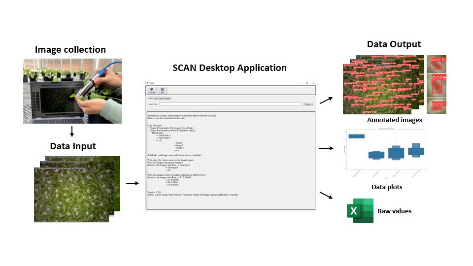
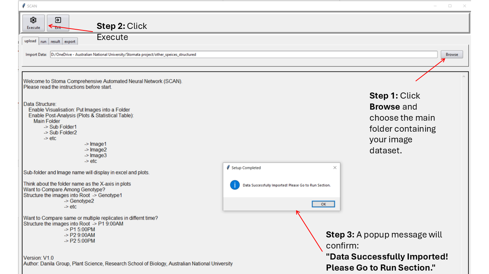
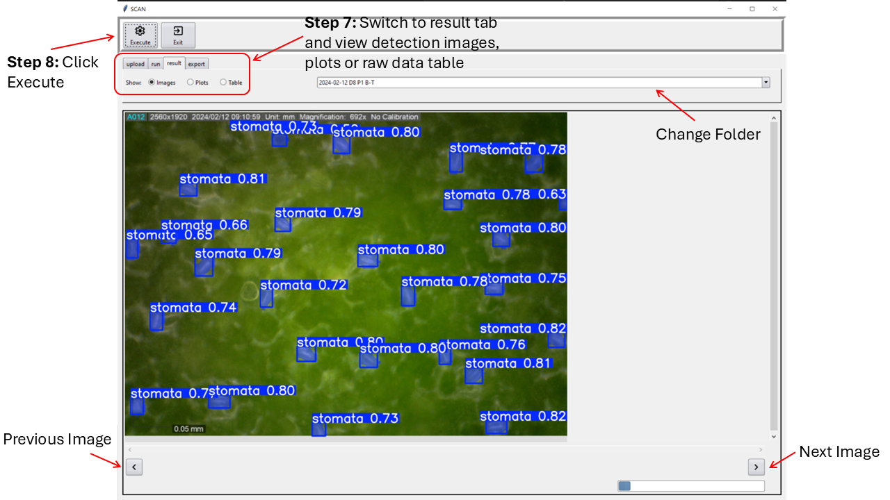
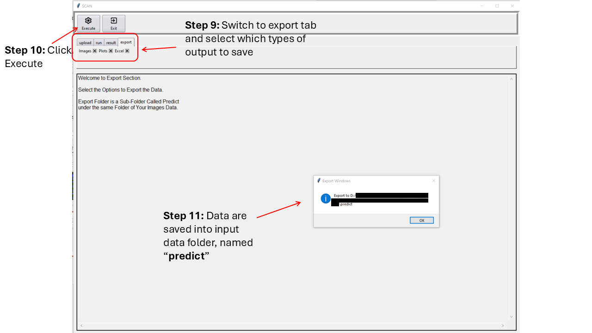

# Stomatal Comprehensive Automated Neural Network(SCAN)
## About
The *Stomatal Comprehensive Automated Neural Network* (SCAN) is a deep learning-based software tool developed for the automated measurement of stomatal traits in *Brassica napus* (canola). SCAN integrates high-resolution digital microscopy with a YOLOv8-based machine learning pipeline to accurately quantify stomatal density, stomatal size, and pore area from leaf surface images.
Designed with accessibility in mind, SCAN offers a portable, offline desktop application that requires no advanced programming knowledge, making it suitable for researchers in plant biology and field phenotyping. In addition to its high accuracy in canola (89–94%), SCAN demonstrates generalizability across multiple plant species not included in its training dataset, including *Arabidopsis*, rice, wheat, and maize.
By combining non-destructive imaging, real-time analysis, and minimal hardware requirements, SCAN supports high-throughput, field-deployable phenotyping of leaf stomatal traits.



## **System Requirements**
Before installation, ensure the following tools are installed:

- **[Miniconda](https://docs.anaconda.com/free/miniconda/)** (for Python environment management)
- **[Git](https://git-scm.com/downloads)** (for repository cloning)

## **Installation Instructions**
### Step 1: Install Miniconda and Git
Install Miniconda appropriate for your operating system. After installation, initialize the shell:

- **Windows**:  
  Open *Anaconda Prompt (Miniconda3)* and execute:
  ```bash
  conda init
  ```
- **macOS/Linux:**
  Open a terminal and run:
  ```bash
  ~/miniconda3/bin/conda init bash
  ~/miniconda3/bin/conda init zsh
  ```

Ensure `git` is installed by downloading it from the [official Git site](https://git-scm.com/downloads).


### Step 2: Clone the Repository

In your terminal or Anaconda Prompt, clone the SCAN repository and navigate to the directory:

```bash
git clone https://github.com/William-Yao0993/SCAN.git
cd SCAN
```

### Step 3: Set Up the Python Environment

Create the SCAN environment using the provided YAML file:

```bash
conda env create -f environment.yml
```

## **Running SCAN**

1. Ensure your working directory is the SCAN project folder:
   ```bash
   cd SCAN
   ```

2. Activate the SCAN environment:
   ```bash
   conda activate SCANenv
   ```

3. Launch the application:
   ```bash
   python -m main
   ```

> **Note**: The first initialization may take 10–20 seconds depending on system performance.

## **Step-by-Step Guide to Using SCAN**
---

### Step 1: Select Your Data Folder
Click **Browse** and choose the main folder containing your image dataset.

### Step 2: Click `Execute`
This will load your data into SCAN.

### Step 3: Confirmation
A popup message will confirm:  
**"Data Successfully Imported! Please Go to Run Section."**


---

### Step 4: Navigate to the `Run` Tab
Here you can configure parameters for different species, such as:
- **Aperture Step**
- **Confidence Threshold**
- **Scale Bar Length (Unit & Pixels)**

Refer to the table for typical values by species.

### Step 5: Click `Execute` to Start Model Prediction
SCAN will perform stomata detection, segmentation, and pore analysis.  
Progress is shown in the status bar below.

### Step 6: Execution Complete
You’ll receive a popup:  
**"Execution Completed. Please Start the Next Operation."**


---

### Step 7: Go to the `Result` Tab
Switch to view:
- **Detection Images**
- **Statistical Plots**
- **Raw Data Tables**

Use the dropdown to switch folders, and arrow buttons to browse images.

### Step 8: Click `Execute`
Apply the display settings for the selected output type.


---

### Step 9: Navigate to the `Export` Tab
Select which outputs to save:
- Images
- Plots
- Excel Data

### Step 10: Click `Execute`
Exports your selected outputs.

### Step 11: Export Complete
A popup confirms the save location:  
Files are stored in a subfolder named `predict` under your input directory.



### Scale bar practical measurement
| Species | Resolution | Magnification | Length1 | Unit1 | Length2 |Unit2 | 
|---------|------------|---------------|---------|-------|---------|------|
|Arabidopsis| 2560 X 1920 | 690.5±1 X | 0.05 | mm | 221 | pixel |
| Canola | 2560 X 1920 | 692±2 X | 0.05 | mm | 222 | pixel |
| Canola | 1280 X 960 | 691±2 X | 0.05 | mm | 112 | pixel |
| Maize | 2560 X 1920 | 413±1 X | 0.1 | mm | 269 | pixel |
| Tobacco | 2560 X 1920 | 690.5±1 X | 0.05 | mm | 221 | pixel |
| Panicum miliacecm | 2560 X 1920 | 413±1 X | 0.1 | mm | 269 | pixel |
| Rice | 2560 X 1920 | 413±2 X | 0.1 | mm | 267 | pixel |
| Rice | 2560 X 1920 | 413±1 X | 0.05 | mm | 227 | pixel |
| Wheat | 2560 X 1920 | 692±1 X | 0.05 | mm | 224 | pixel |
| Wheat | 2560 X 1920 | 412.5±1 X | 0.1 | mm | 267 | pixel |
-------------------------------------------------------------------------------------


## For training 
Please refer to this repository for model weights and training parameters: https://github.com/William-Yao0993/FD_detection

## Citation

If you use this project in your research or wish to refer to the baseline results, please cite us.

```bibtex
@article {Yao2024.06.12.598768,
	author = {Yao, Lingtian and von Caemmerer, Susanne and Danila, Florence R},
	title = {Automated and high throughput measurement of leaf stomatal traits in canola},
	elocation-id = {2024.06.12.598768},
	year = {2024},
	doi = {10.1101/2024.06.12.598768},
	publisher = {Cold Spring Harbor Laboratory},
	URL = {https://www.biorxiv.org/content/early/2024/06/14/2024.06.12.598768},
	eprint = {https://www.biorxiv.org/content/early/2024/06/14/2024.06.12.598768.full.pdf},
	journal = {bioRxiv}
}

```